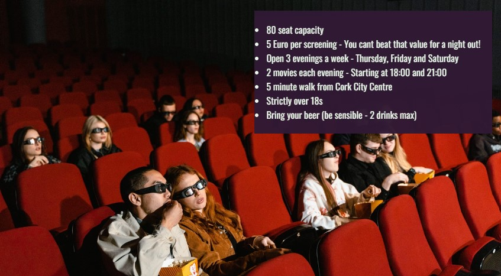

# RetroVision
(Developer: Terry Martin)

[Live webpage](https://terry-martin.github.io/RetroVision/index.html)

## Table Of Contents

1. [Project Goals](#project-goals)
  1. [User Goals](#user-goals)
  2. [Website Owner Goals](#website-owner-goals)
2. [User Experience](#user-experience)
    1. [Target Audience](#target-audience)
    2. [User Requrements and Expectations](#user-requirements-and-expectations)
    3. [User Stories](#user-stories)
3. [Design](#design)
    1. [Design Choices](#design-choices)
    2. [Colour](#colour)
    3. [Structure](#structure)
    4. [Wireframes](#wireframes)
4. [Technologies Used](#technologies-used)
    1. [Languages](#languages)
    2. [Frameworks and Tools](#frameworks-and-tools)
5. [Features](#features)
6. [Testing](#validation)
    1. [HTML Validation](#HTML-validation)
    2. [CSS Validation](#CSS-validation)
    3. [Accessibility](#accessibility)
    4. [Performance](#performance)
    5. [Device testing](#performing-tests-on-various-devices)
    6. [Browser compatibility](#browser-compatability)
    7. [Testing user stories](#testing-user-stories)
8. [Bugs](#Bugs)
9. [Deployment](#deployment)
10. [Credits](#credits)
11. [Acknowledgements](#acknowledgements)

## Project Goals

### User Goals
- Find local cinema
- Browse genre of movies
- Verify the days the cinema is open
- Check movies that are showing in current week
- Confirm start times for each movie
- Establish price of ticket
- Check tickets are available for particular movie
- Reserve tickets to see movie

### Website Owner Goals
- Showcase the features of the venue
- Promote the film genre and era of movies that are shown
- Update site users on new features to the website
- Display current weeks movies
- Highlight rules for attending cinema
- Simplyfy ticket booking system for both customer and admin team
- Advocate for a frindly enviorment and foster a club like atmosphere
- Increase ticket sales
- High Search Engine Optimisation
- Strong performance and webpage load times

## User Experience

### Target Audience
This website is designed for the below target audience:
- Fans who appreaciate movies on the big screen
- People who enjoy Martial Arts, Action and Western movie genres
- Adults over the age of 18
- Patrons looking for a fun, inexpensive evening out
- Folks looking to meet up with friends or new people that share similar interests

### User Requirements and Expectations
- Easy to use navigation system to link each internal page
- Consistentcy of layout and navigation throughout site
- Scalable for any screen size
- Quick webpage load times
- Intuitive access to required information
- Information on display is up to date
- Friendly tone throughout web pages
- Confirmation that actions are complete (especially that tickets are reserved)

### User Stories

#### First Time User
1. As a first time user, I want learn more about the cinema location
2. As a first time user, I want to know the details about the venue
3. As a first time user, I want to find out any restrictions on entry to venue or age retrictions
4. As a first time user, I want to see what movie genres the cinema specialises in
5. As a first time user, I want to check the opening days and times
6. As a first time user, I want to verify which movies are on this week
7. As a first time user, I want to ensure tickets are available for this particular movie
8. As a first time user, I want to understand the price of tickets
9. As a first time user, I want to book tickets for the movie I want to see

#### Returning User
9. As a returning user, I want to check if i can reserve a particular seat
10. As a returning user, I want to learn if there are any offers available for multiple viewing or a season pass
12. As a returning user, I want to make suggestions for future movies

#### Site Owner
13. As a site owner, I want to display the feaures of the venue
14. As a site owner, I want customers to understand the age restrictions on the venue and the movies
15. As a site owner, I want patrons to have a positive experience with the website from land page all the way to confirmation taht ticket is booked
16. As a site owner, I want to have a successful business that I enjoy being part of while also ensuring the customers feel appreicated

## Design

### Design Choices
The website was designed to give a friendly, engaging tone with our potential customer base.

### Colour
Minimal colours were utilised in this website and were consitent for each page. CHanging colour was used to highligh user actions in nav bar and footer. Images on Listings page were AI generated art with a "Retro" style. Again, that matched the clean, reduced colour number atmosphere. 

### Structure
Each of the 3 webpages was set up with a basic Grid to allow for more simplistic responsivity for different screen sizes by reducing column count for smaller screens. The Header and Footer are consitent for the 3 pages.:
- Index page: Gives a welcome message and explians new features to the relaunched website. Details venue features along with a n image of same. Highlights the three film genres that the cinema concentrates on with three images and text heading.
- Listings page: Shows a list of movies that are showingin current week. Gives the name, running time, age restriction, ticket availability and book ticket option for each movie. Title of movie is external link to its IMBD page. Book Ticket option links to internal Tickets page. Any movie sold out is displayed and does not have Book Ticket option. Background image is computer generated for genre with a design emphasis on retro and fun.
- Tickets page: Allows users to choose which movie they want to see and book it, along with a confirmation. Input fields are validated. Three images of the film genres are showing in rotation, so only one at a time in auto slideshow. Image will pause when mouse hovers on it.

### Wireframes

- Index page

- Listings page

- Tickets page

- Contact Us page (not included in website but would be added to include Google Map)

## Technologies Used

### Languages
The following languages were used to develop the website:
- HTML
- CSS

### Frameworks and Tools
The following frameworks and tools were used to develop the website:
- Git
- Github
- Gitpod
- Google Fonts
- Font Awesome
- Balsamiq
- Starryai
- Dream Wombo

## Features

### Header (Logo, Title and Navigation Bar)
- Consistent on each page
- Font size reduced for smalled devices
- Hightlights which page user is currently on
- Page name changes colour/background when mouse over

### Footer
- Shows on every page like the header
- Like the header, the social links also stack underneath the copyright text on smaller screens

### Index-->Welcome
- Advises users of relaunch of website and upcoming features

### Index-->Venue
- Shows an image of the venue
- Contains details about venue capacity, pricing and age restrictions

### Index-->Film Genre
- Shows a heading and an image of each of the three feature film genres - Western, Martial Arts and Action

### Listings-->Current days movie listings
- Shows the films on offer for current week. Three days. Each day dedicated to one genre
- Show movie details, ticket availability, link to imdb page and link to internal booking page

### Tickets-->Booking Form
- Allows selection of movie
- Captures user info
- Book tickets button with confimration

![Mockup image](assets/images/readme/tickets-info-reserve-form.jpg

### Tickets--> Slideshow
- Shows three images for the genres rotating automatically in slideshow format

## Validation

### HTML Validation

The W3C Validator is used to validate HTML documents. This ensures that all unintended mistakes are spotted before release, so that they can be corrected. All of my pages passed the check without any errors.

The W3C Jigsaw CSS Validator is used to validate HTML documents. This ensures that all unintended mistakes are spotted before release, so that they can be corrected. All of my pages passed the check without any errors.

### Accessibility

The WAVE web accessibility evaluation tool by WebAIM was used to ensure the webpages met accessibility standards. All 3 pages passed without any errors.

### Performance

The Google Lighthouse tool, within the Google Chrome Developer Tools was used to ensure that each page met a high performance rating. This shows that the website will load efficiently over various devices.

### Performance tests on various devices

Throughout development and testing, I used the following devices to ensure that the site was responsive, and worked as intended.

- Samsung Galaxy S23

### Browser Compatibility

The website was tested on several web browsers to ensure consistency. The browsers used are as follows:

- Microsoft Edge
- Google Chrome

### Testing User Stories

Story - As a first time user, I want to ensure tickets are available for this particular movie
Solution - Link to Tickets form from every page of website. Listings page has a linethrough for any unavailable movie. Book now option disabled from that page.

Story - As a first time user, I want to find out any restrictions on entry to venue or age retrictions
Solution - The age limit and venue opening days/times are displayed on the first page in the main image. 

## Bugs

- Issue: Width of screen on mobile view
- Solution: Reduce all font-size to 16 and reduce padding/margin for small screens

- Issue: Overlaying text on image within grid item in Listings page
- Solution: Changed image to background-image

- Issue: Form Button not doing anything when clicked
- Solution: Removed second form and included all controls in single form

## Deployment

The website was deployed through the use of GitHub.
-  Settings --> Pages --> Deploy from a branch --> Deploy from a branch -->Save

## Credits

#### Images

-Free images were sourced from Pexels and Pixabay
-AI images were generated using Craiyon, Starryai and Dream Wombo

### Code

- HTML/CSS: Sources included in code comments
- Navigation Menu based on Code Institute example

## Acknowledgements

I would like to thank the below:
- Code academy facilitator
- My classmates
- Everyone that keeps Slack going. This really helps with general support and solutions for all those nagging code issues.